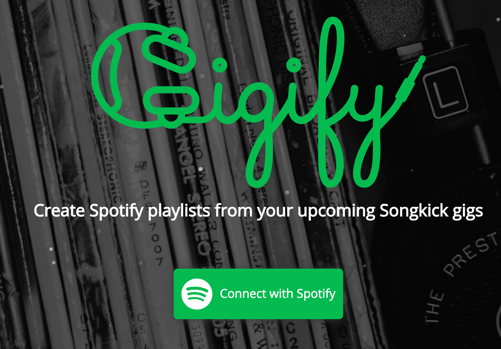

<h2>What is Gigify?</h2>

<h3>Gigify is an artist discovery tool.</h3>

I've always been an avid concert-goer, but noticed myself taking less time to research music as life grew busier. I wanted a tool that would not only tell me what's playing in my area, but seamlessly create a playlist to see if any of the gigs interested me.

  

    

      <h3>How does it work?</h3>
      
It populates a list of events based on a user's local Songkick gigs, then lets them generate a Spotify playlist based on the events they select.

    

    

      
    

  

  

    

      <h3>Generate a playlist</h3>
      
Gigify populates a list of a user's upcoming Songkick events. The user selects the ones that interest them, and a Spotify playlist is generated from the event's artists.

    

    

        
    

  

