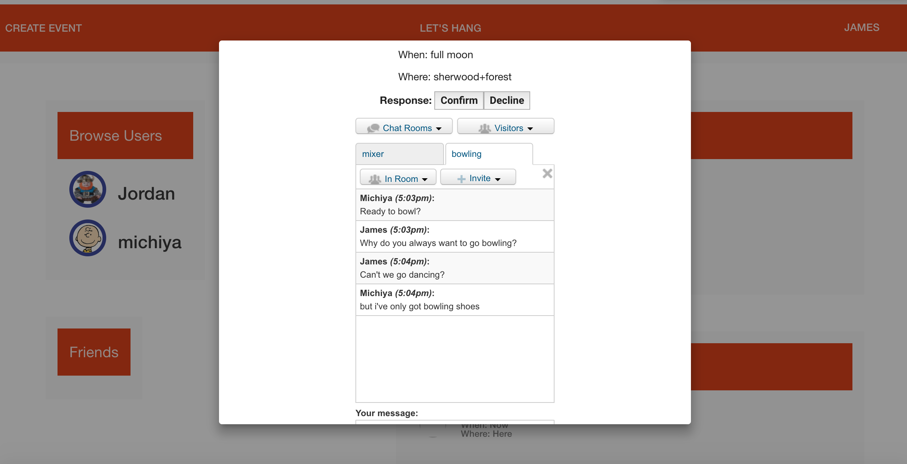

<h2>What is Hang?</h2>

<h3>Hang is a shared event calendar and chat application</h3>

Create a profile with an avatar. Find your friends, then receive event invitations or create your own. You can let your friends know when you're available by clicking a "Let's Hang" button at the top of the screen.

  

    

      <h3>How does it work?</h3>
      
You can click on a hosted event (or one you're invited to) and join the live event chat room which includes all the other guests.

    

    

      
    

  

  <!-- 
 -->
    <!-- 

      <h3>Generate a playlist</h3>
      
Gigify populates a list of a user's upcoming Songkick events. The user selects the ones that interest them, and a Spotify playlist is generated from the event's artists.

    
 -->
    <!-- 

        
    
 -->
  <!-- 
 -->

