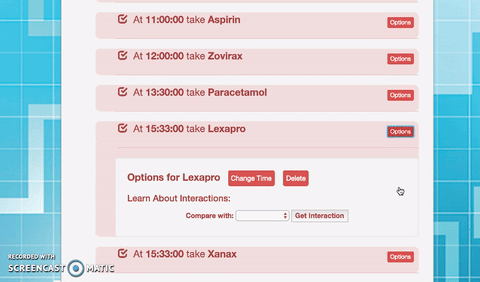

<h2>Reminder-X?</h2>

<h3>Reminder-X is a tool that keeps track of daily medications and sends text reminders.</h3>

Many people, especially as they age, may end up with complicated medication schedules. Different medications may need to be taken at different times of day, on various days of the week, and it can be hard to keep track. Reminder-X is a simple to set up text notification system for medications.

  

    

      <h3>How does it work?</h3>
      
It uses Cron and Twilio to set up automated text reminders. Users receive a text with their medication name at the time specified. Users are also able to toggle whether they have taken the medication, which disables the reminder for the day.

    

    

      
    

  

  

    

      <h3>Check Interactions</h3>
      
We also allow curious users to check drug interactions. It's as easy as selecting two drugs from their list, while we query a series of medical APIs to return interaction information.

    

    

        
    

  

